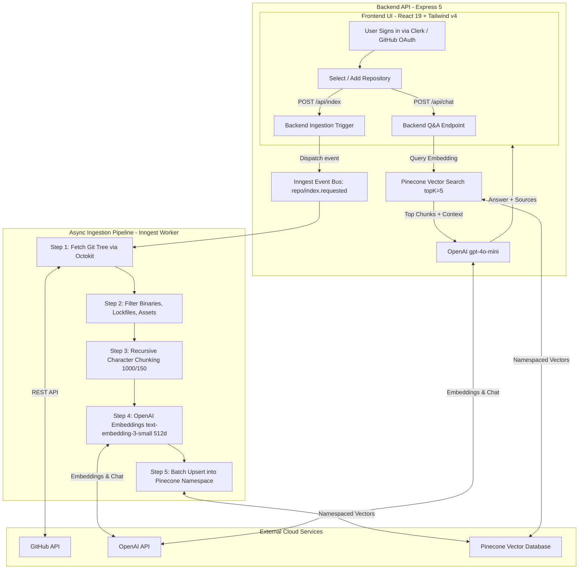

# GitWiki RAG

A developer tool that lets you chat with any GitHub repository using Retrieval-Augmented Generation (RAG). Paste a repo link, index its source code, and ask questions with answers backed by real file citations.

---

## What is this project about?

GitWiki RAG is an AI assistant for understanding GitHub codebases:

- **Index Repositories**: Automatically fetches and indexes source code files from GitHub while filtering out lockfiles, binaries, and build artifacts.
- **Ask in Plain English**: Query architecture, logic, or implementation details naturally.
- **Grounded Answers**: LLM answers are strictly grounded in retrieved code chunks from Pinecone.
- **Source Citations**: Every answer provides clickable links directly to the referenced files on GitHub.
- **Background Jobs**: Ingestion and embedding are processed asynchronously using Inngest to prevent timeouts.

---

## How to clone and run this repo

### 1. Clone the repository

```bash
git clone https://github.com/Mahesh0426/Git_wiki_RAG.git
cd Git_wiki_RAG
```

### 2. Backend Setup

```bash
cd backend
pnpm install
```

Create a `.env` file in the `backend/` directory:

```env
PORT=8001
INNGEST_DEV=1
OPENAI_API_KEY=your_openai_api_key
PINECONE_API_KEY=your_pinecone_api_key
PINECONE_INDEX=git-wiki-rag
GITHUB_TOKEN=your_github_token   # Optional, for private repos and higher rate limits
```

> **Note on Pinecone**: Ensure your Pinecone index is created with **Metric: Cosine** and **Dimensions: 512**.

Start the backend server and Inngest dev server:

```bash
# Terminal 1: Start Express server
pnpm dev

# Terminal 2: Start Inngest local dev server
npx inngest-cli@latest dev -u http://localhost:8001/api/inngest
```

### 3. Frontend Setup

```bash
cd ../frontend
pnpm install
```

Create a `.env` file in the `frontend/` directory:

```env
VITE_CLERK_PUBLISHABLE_KEY=your_clerk_publishable_key
VITE_API_BASE_URL=http://localhost:8001
```

Start the Vite development server:

```bash
pnpm dev
```

Open `http://localhost:5173` in your browser.

---

## Folder Architecture

```text
Git-wiki-RAG/
├── backend/
│   ├── src/
│   │   ├── inngest/
│   │   │   ├── client.js          # Inngest client configuration
│   │   │   ├── index.js           # Function exports array
│   │   │   └── functions/         # Background workflows (indexRepo, askQuestions)
│   │   ├── routes/
│   │   │   ├── chat.routes.js     # POST /api/chat endpoint
│   │   │   └── index.routes.js    # POST /api/index endpoint
│   │   ├── services/
│   │   │   ├── chunking.js        # Recursive text splitting (LangChain)
│   │   │   ├── github.js          # Octokit tree traversal & file decoding
│   │   │   ├── rag.js             # Vector search + OpenAI LLM answer generation
│   │   │   └── vectorStore.js     # Pinecone embeddings & similarity search
│   │   └── server.js              # Express app bootstrap & Inngest endpoint
│   └── package.json
│
├── frontend/
│   ├── src/
│   │   ├── components/
│   │   │   ├── auth/              # Clerk login hero & missing key screen
│   │   │   ├── chat/              # Chat input, messages, and source citation list
│   │   │   ├── layout/            # Header and repo switcher sidebar
│   │   │   └── repo/              # Modal to index a new GitHub repo
│   │   ├── services/
│   │   │   └── api.js             # API service for backend communication
│   │   ├── App.jsx                # Main workspace state & multi-repo chat
│   │   ├── index.css              # Tailwind CSS v4 design system
│   │   └── main.jsx               # ClerkProvider setup
│   ├── package.json
│   └── vite.config.js
│
└── README.md
```

---

## Technology Used

### Backend

- **Node.js & Express 5**: REST API server and routing
- **Inngest**: Event-driven background queue for repository indexing
- **Octokit**: GitHub API client for repository tree traversal and blob retrieval
- **LangChain**: Text splitters (`RecursiveCharacterTextSplitter`)
- **Pinecone**: Vector database for isolated repository namespaces
- **OpenAI**: `text-embedding-3-small` (512 dimensions) for embeddings and `gpt-4o-mini` for answering questions

### Frontend

- **React 19 & Vite**: Fast frontend framework and bundler
- **Tailwind CSS v4**: Dark developer theme styling
- **Clerk**: GitHub OAuth authentication
- **React Markdown & Rehype Highlight**: Markdown formatting and syntax-highlighted code blocks
- **Lucide React**: UI icons

---

## How to use this application

1. **Sign in**: Open `http://localhost:5173` and sign in with your GitHub account via Clerk.
2. **Index a repository**: Click the **Index Repository** button in the sidebar, paste any GitHub repository link (e.g. `expressjs/express` or `facebook/react`), and click **Index**.
3. **Wait for ingestion**: Inngest will fetch the files, chunk the code, and save embeddings to Pinecone in the background.
4. **Chat**: Select the repository from your sidebar and start asking questions in the chat box (e.g., _"How does the routing system work?"_).
5. **Inspect sources**: Click on any source link at the bottom of an answer to view the exact code file directly on GitHub.

## system design architecture


